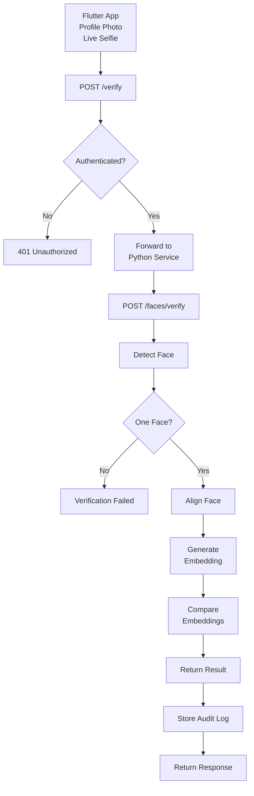
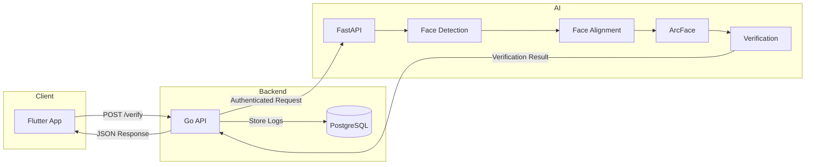
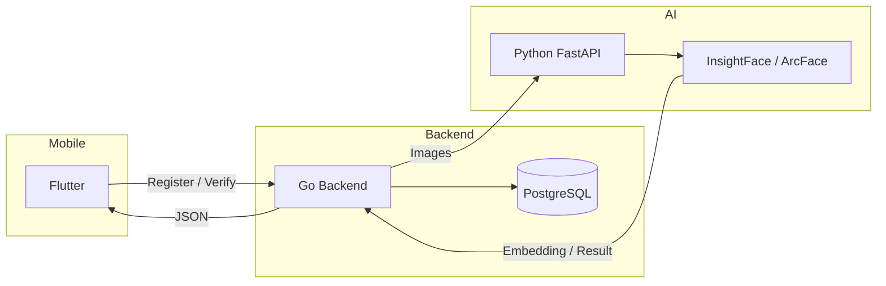

# Menmo Microservice design 
## 1. Verification Flow chart

```mermaid
flowchart TD

    A["Flutter App<br/>Profile Photo<br/>Live Selfie"]

    A --> B["POST /verify"]

    B --> C{"Authenticated?"}

    C -- No --> D["401 Unauthorized"]

    C -- Yes --> E["Forward to<br/>Python Service"]

    E --> F["POST /faces/verify"]

    F --> G["Detect Face"]

    G --> H{"One Face?"}

    H -- No --> I["Verification Failed"]

    H -- Yes --> J["Align Face"]

    J --> K["Generate<br/>Embedding"]

    K --> L["Compare<br/>Embeddings"]

    L --> M["Return Result"]

    M --> N["Store Audit Log"]

    N --> O["Return Response"]
```

## 2. System Architecture

```mermaid
flowchart LR

    subgraph Client
        A["Flutter App"]
    end

    subgraph Backend
        B["Go API"]
        C[("PostgreSQL")]
    end

    subgraph AI
        D["FastAPI"]
        E["Face Detection"]
        F["Face Alignment"]
        G["ArcFace"]
        H["Verification"]
    end

    A -->|"POST /verify"| B

    B -->|"Authenticated Request"| D

    D --> E
    E --> F
    F --> G
    G --> H

    H -->|"Verification Result"| B

    B -->|"Store Logs"| C

    B -->|"JSON Response"| A
```

## 4. High-Level Microservice Architecture

```mermaid
flowchart LR

    subgraph Mobile
        A["Flutter"]
    end

    subgraph Backend
        B["Go Backend"]
        C[("PostgreSQL")]
    end

    subgraph AI
        D["Python FastAPI"]
        E["InsightFace / ArcFace"]
    end

    A -->|"Register / Verify"| B

    B -->|"Images"| D

    D --> E

    E -->|"Embedding / Result"| B

    B --> C

    B -->|"JSON"| A
```
